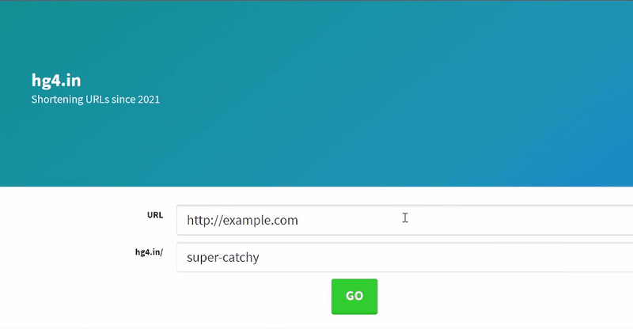

# 🔥 Custom-URL-Shrinker

Make any long URL short, also can give your custom slug-key. 

## Demo

## Tech Stack

**Client:** ejs , Bootstrap

**Server:** Node, Express, Mongodb/mongoose

## Roadmap

- Setup a Node/Express server
-
- Created client with ejs and bootstarp.

- Setup a Mongodb connection using Mongoose.

  - Create route to add url to db.

  - validate URL.

  - Make sure name is not in use, Respond with error if in use.

- Deployed on Heroku and MongoDB atlas.
